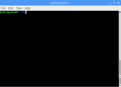
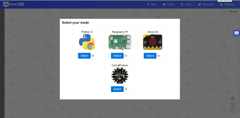

# Getting Started with EduBlocks

## What Is EduBlocks?
Edublocks is a program that allows you to write real Python code using a visual block format, similar to Scratch. Edublocks is helping educators teach younger children how to program in Python using blocks and by the time they are able to move on to written Python they will already understand the Python syntax and program flow.

EduBlocks can be used with the Raspberry Pi, micro:bit, Adafruit Circuit boards like the Circuit Playground Express, and Python3 within a web browser like Chrome.

The Python3 and micro:bit modes of Edublocks will work as soon as you click on them. The Raspberry Pi and Adafruit Circuit Playground Express board need a few extra steps to use, as shown below:

## How to Setup EduBlocks on Raspberry Pi
EduBlocks does not come pre-installed on the Raspberry Pi, so we first need to open up a terminal window, which can be done by clicking on the icon that looks like this .  It is located at the top of the screen near the menu icon.

Once the Terminal has opened you will see a window similar to this:
<br>
 

Now you need to type the following command:

```bash
curl -sSL connect.edublocks.org | bash
```
Once you have typed in the line above, press enter. The software will then install itself.

When it's done, type in the following and press enter once again:
```bash
edublocks-startup-enable
```
This will make EduBlocks start whenever the Raspberry Pi starts up.

## How to Setup EduBlocks on the Circuit Playground Express
Circuit Playground Express is by default set up to use MakeCode, while we want to run Circuit Python.

To install Circuit Python, open up a web browser and type `https://circuitpython.org/board/circuitplayground_express/`
This will take you to the software page for the Circuit Playground Express (CPX). It is recommended that you install the most stable version of Circuit Python by clicking on **Download .UF2 Now**. This will download the latest version of Circuit Python to your computer.  

Once the download has completed, we need to transfer the file to the CPX.

1. Plug the CPX into your computer using a micro USB cable.
2. Double press the reset button. you should see all the neopixels turn green. If they turn red, unplug the CPX and try again.
3. Locate the .UF2 file on your computer.
4. Click and drag the file and drop it onto the **CPLAYBOOT** drive. All the neopixels will turn off and the CPX drive will load back up as **CIRCUITPY**

You are now ready to program your CPX using EduBlocks.

## Starting EduBlocks
Open any web browser on any system and type `app.edublock.org` within the address bar.
You will see the following screen:

<br>
Click on the mode that you want to use.

We will dig deeper into the different modes in other tutorials.

Until next time.

#### Keep having FUN while LEARNING!  
