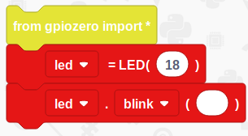

# Blinking an LED
Within this tutorial we are going to make an LED blink on and off using EduBlocks and a Raspberry Pi.

## Equipment You Will Need

* 1 x LED
* 2 x male to female jumper wires
* 1 x breadboard
* 1 x 330 ohm resistor
* Raspberry Pi
* keyboard
* Mouse
* SD Card with Raspbian installed
* HDMI cable
* Compatible Screen
* Power Supply

## The Circuit
Lets build the circuit. Make sure you have your LED the right way round. The positive leg is the longer leg on the LED, this is represented by the bent leg in the diagram below:

## Starting EduBlocks
There are two things we need to do to start EduBlocks

1. Go to menu -> programming and click on EduBlocks Connect. (if you have EduBlocks set to start on Startup go to step 2)
2. open a web browser and type [app.edublocks.org](app.edublocks.org) and click on Raspberry Pi.

**NOTE:** If you have a raspberry pi set up on your home network with EduBlocks installed and running you can access it from another computer using it's IP address

## Code
1. Click on **gpiozero**
2. Click on **General** click and drag a **from gpiozero import *** to the coding area and drop it.
3. Click on **Outputs**.
4. Click on **LED**. Click and drag an **led =LED()** block to the coding area and attach it under **from gpiozero ***
5. Click within the blank space of the **from gpiozero import *** block and type **18**.
3. Click on **LED** click and drag an **led.on()** block to the coding area and attach it under **led =LED(18)**. Click on the arrow next to on and click on **blink**

Your code should now look like this:

## Running the code
To run your code click on **Run** on the toolbar above the coding area. 

You should now see the LED attached to your Raspberry Pi blink on and off.

Well done you have made an LED blink on and off by using your Raspberry Pi and code!

### Keep having FUN while LEARNING!