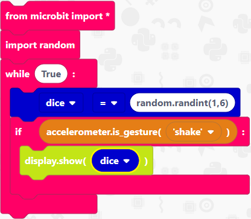

# Code a Dice (simple)

Within this tutorial you are going to learn how to code a dice using a BBC micro:bit and EduBlocks.

1. Open the Edublocks code editor by going to [app.edublocks.org](www.microbit.edublocks.org)

2. Click on **Basic**, click and drag an **from microbit import *** and drop it within the coding area.

3. Click on **Basic**, click and drag an **import random** block to the coding area and attach it under **from microbit import ***

4. Click on **Basic**, click and drag a **while True:** block to the coding area and attach it under **import random**

5. Click on **Variables**, Click on **Create variable**, type **dice** and press enter on the keyboard.

6. Click and drag a **dice = 0** to the coding area and attach it within the **while True:** block

7. Click where the **0** is and delete it, now type **random.randint(1,6)**

8. Click on **Basic**, click and drag an **if True:** block to the coding area and attach it under **dice = random.randint(1,6)**

9. Click on **Accelerometer**, click and drag a **accelerometer.is_gesture(shake)** and attach it where it says **True** within the **if** block.

10. Click on **Display**, click and drag a **display.show(Image.HAPPY)** to the coding area and attach it within the **if accelerometer.is_gesture('shake')** 

11. Click on **Variables**, click and drag a **dice** block to the coding area and attach it within the **display.show** block where it says **Image.HAPPY**

Your code should look like this:

